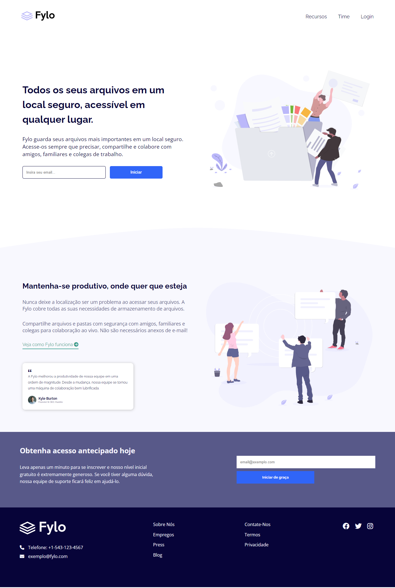

# Frontend Mentor - Fylo landing page with two column layout solution

This is a solution to the [Fylo landing page with two column layout challenge on Frontend Mentor](https://www.frontendmentor.io/challenges/fylo-landing-page-with-two-column-layout-5ca5ef041e82137ec91a50f5). Frontend Mentor challenges help you improve your coding skills by building realistic projects.

## Table of contents

- [Overview](#overview)
  - [Screenshot](#screenshot)
  - [Links](#links)
- [My process](#my-process)
  - [Built with](#built-with)
  - [What I learned](#what-i-learned)
  - [Useful resources](#useful-resources)
- [Author](#author)

## Overview

### Screenshot

### Links

- Solution URL: [https://www.frontendmentor.io/solutions/fylo-landing-page-ptbr-html-css-sass-jIMc_QKmDE](https://www.frontendmentor.io/solutions/fylo-landing-page-ptbr-html-css-sass-jIMc_QKmDE)
- Live Site URL: [https://wat-fylo.vercel.app/](https://wat-fylo.vercel.app/)

## My process

### Built with

- Semantic HTML5 markup
- CSS custom properties
- Flexbox
- Mobile-first workflow
- [SASS](https://sass-lang.com/) - For styles

### What I learned

I applied the "Mobile First" concept for the first time and I am very happy with the results.

### Useful resources

- [Font Awesome](https://fontawesome.com/) - This helped me for icons.
- [AOS Animate On Scroll Libary](https://michalsnik.github.io/aos/) - This helped me for Animations.

## Author

- GitHub - [Wachiles](https://github.com/wallacycaike)
- Frontend Mentor - [@wachiles](https://www.frontendmentor.io/profile/wallacycaike)